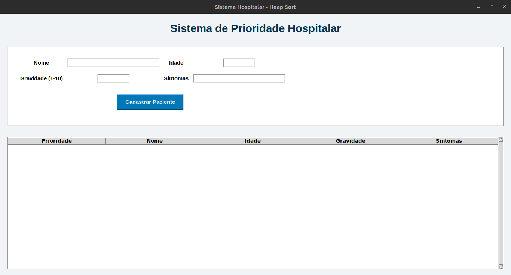
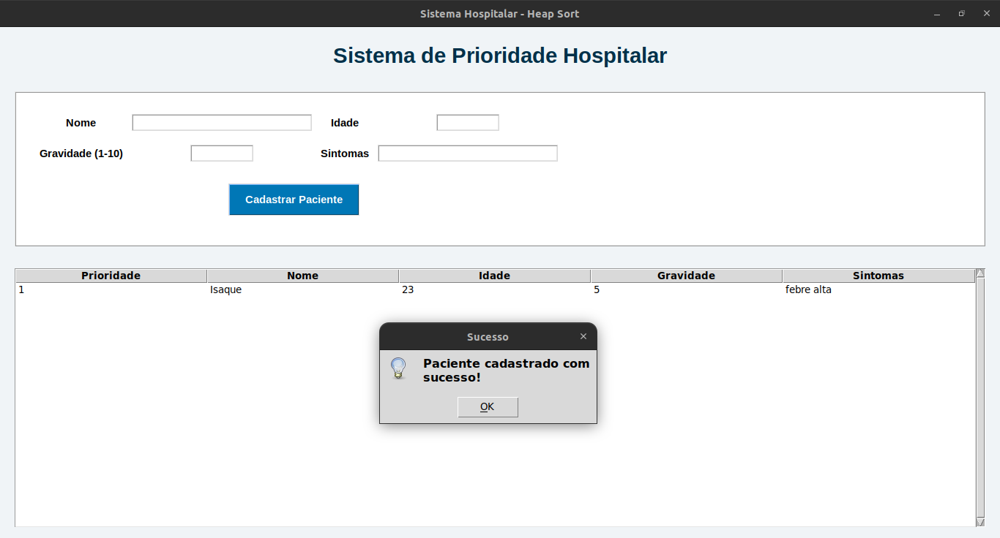
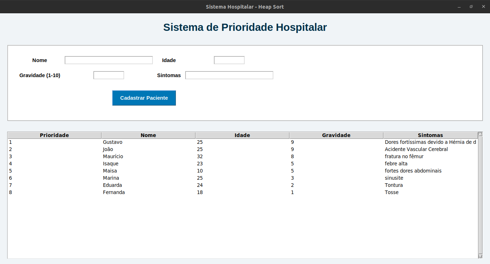

# Prioridade de Emergência

Número da Lista: 22
Conteúdo da Disciplina: Algoritmos de Ordenação (Estruturas de Dados II)

## Alunos

| Matrícula | Aluno                            |
| --------- | -------------------------------- |
| 211061903 | Isaque Santos                    |
| 200023985 | Maria Eduarda dos Santos Marques |

## Sobre

Este trabalho tem como objetivo realizar o cadastro e priorização de pacientes utilizando o algoritmo de ordenação Heap Sort. A ordenação de cada paciente é realizada por gravidade, onde a maior gravidade = maior prioridade.

## Screenshots

Tela inicial do programa



Exibição de cadastro de paciente



Resultado da tabela de prioridade 




### Vídeo do trabalho

[Clique aqui para assistir à demonstração]()


## Instalação


### Pré-requisitos

* Python 3.8 ou superior
* Tkinter (em algumas distros: `sudo apt install python3-tk`)
* Terminal ou prompt de comando


### Compilação e Execução no Linux

Para executar a versão Python da aplicação:

```bash
python3 src/main.py
```

## Outros

### Funcionalidades

* Cadastro de pacientes (nome, idade, gravidade, sintomas)
* Ordenação por gravidade usando Heap Sort
* Exibição em tabela com prioridade
* Validação básica de campos (gravidade entre 1 e 10)

### Algoritmos Utilizados

Heap Sort:

O algoritmo constrói um heap máximo usando o atributo `gravidade` dos objetos `Paciente` e realiza a ordenação em tempo O(n log n).

## Complexidade

| Recurso | Melhor caso | Caso médio | Pior caso |
|--------:|:-----------:|:---------:|:---------:|
| Tempo   | O(n log n)  | O(n log n)| O(n log n)|
| Espaço  | O(1) (in-place) | O(1) (in-place) | O(1) (in-place) |


